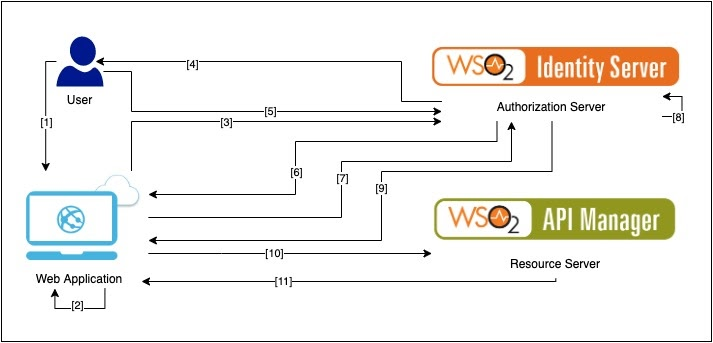

# PKCE example

## Architecture Diagram

## PKCE Flow
1. The user clicks the login button in the application.
2. The web/mobile application generates a cryptographically random code verifier and using this generates a code challenge.
3. The challenge request is made to the authorization server (/authorize).
4. The authorization server redirects to the user with an authorization prompt along with the code challenge.
5. The user authenticates using the configured login options provide the consent page listing the permissions the authorization server will give to the application.
6. The authorization server stores the code challenge and redirects the user back to the application with an authorization code which is suitable for use.
7. The web/mobile application sends the code obtained and the code verifier obtained in step 2 to the authorization server ( /oauth/token endpoint ).
8. The authorization server verifies the code challenge and code verifier.
9. The authorization server responds with an ID token and Access token optionally with a refresh token.
10. The mobile/web application can utilize the access token to call an API to access information about the user.
11. The protected resource API responds with requested data.

## JDK Version
Java SE 1.8

## Download Eclipe
https://www.eclipse.org/downloads/packages/

## Setup Steps
- Download and Install WSO2 Identiy Server
- Download and Install WSO2 API Manager
- Configure a Service Provider with PKCE in WSO2 Identity Server https://docs.wso2.com/display/IS520/Mitigating+Authorization+Code+Interception+Attacks
- Build ss-assignment-2021 using Eclipse and deploy using tomcat java EE server.

## Appendix
### Deploy APIs using WSO2 API Manager
https://apim.docs.wso2.com/en/latest/learn/design-api/publish-api/publish-an-api/

